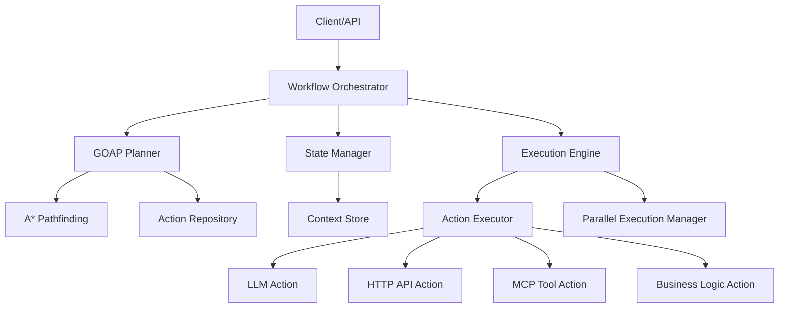

# Agentic Workflow Orchestrator: Architecture and Interfaces

## Table of Contents
1. [Introduction](#introduction)
2. [System Architecture](#system-architecture)
3. [Core Components](#core-components)
   - [GOAP Planner](#goap-planner)
   - [A* Pathfinding](#a-pathfinding)
   - [State Manager](#state-manager)
   - [Action Repository](#action-repository)
   - [Action Types](#action-types)
   - [Execution Engine](#execution-engine)
   - [Parallel Execution Manager](#parallel-execution-manager)

## Introduction

This document outlines the architecture and high-level interfaces of an Agentic Workflow Orchestrator based on Goal Oriented Action Planning (GOAP) principles with A* pathfinding. The system is designed to orchestrate complex workflows for agents such as custom support agents, financial operators, and implement Reason And Act patterns with self-reflection capabilities.

GOAP is a decision-making architecture commonly used in game AI where agents determine a sequence of actions to satisfy a goal based on the current world state. We adapt this approach for workflow orchestration, where the "world state" represents the context of the workflow, and "actions" include operations like LLM calls, HTTP API calls, MCP tool calls, and custom business logic.

The A* algorithm is used to find the optimal path (sequence of actions) from the current state to the goal state, taking into account both the cost of actions and a heuristic estimate of the remaining cost to reach the goal.

## System Architecture

The system architecture is organized into modular components that work together to plan and execute workflows:



The Workflow Orchestrator serves as the central coordinator, receiving requests from clients and orchestrating the planning and execution of workflows. It uses the GOAP Planner to determine the optimal sequence of actions, the State Manager to maintain the world state, and the Execution Engine to execute the actions.

## Core Components

### GOAP Planner

The GOAP Planner is responsible for creating plans that achieve specified goals from the current world state.

```java
public interface Planner {
    /**
     * Creates a plan to achieve the goal from the current state
     */
    Plan createPlan(WorldState currentState, Goal goal, List<Action> availableActions);
    
    /**
     * Checks if a plan is still valid given a state and goal
     */
    boolean isPlanValid(Plan plan, WorldState state, Goal goal);
}
```

### A* Pathfinding

The A* algorithm is the core of our planning system, finding the optimal sequence of actions.

```java
public interface HeuristicFunction {
    /**
     * Calculates the estimated cost from current state to goal
     */
    float calculate(WorldState currentState, Goal goal, List<Action> availableActions);
}
```

### State Manager

The State Manager maintains the world state (context) throughout execution.

```java
public interface WorldState {
    /**
     * Get a property from the world state
     */
    Object getProperty(String key);
    
    /**
     * Set a property in the world state
     */
    void setProperty(String key, Object value);
    
    /**
     * Check if a condition is satisfied in this state
     */
    boolean satisfies(Condition condition);
    
    /**
     * Create a deep copy of this state
     */
    WorldState copy();
    
    /**
     * Get all properties in this state
     */
    Map<String, Object> getAllProperties();
}

public interface StateChangeListener {
    void onStateChanged(WorldState oldState, WorldState newState);
}
```

### Action Repository

The Action Repository manages available actions and their metadata.

```java
public interface ActionRepository {
    /**
     * Register an action
     */
    void registerAction(Action action);
    
    /**
     * Get all registered actions
     */
    Collection<Action> getAllActions();
    
    /**
     * Get actions available in the current world state
     */
    List<Action> getAvailableActions(WorldState state);
    
    /**
     * Mark an action as unavailable (e.g., after failure)
     */
    void markActionAsUnavailable(Action action);
    
    /**
     * Reset availability of all actions
     */
    void resetActionAvailability();
    
    /**
     * Get an action by ID
     */
    Action getAction(String id);
}
```

### Action Types

Actions are the building blocks of plans, with preconditions and effects.

```java
public interface Action {
    /**
     * Get the unique ID of this action
     */
    String getId();
    
    /**
     * Get the display name of this action
     */
    String getName();
    
    /**
     * Check if this action's preconditions are met in the given state
     */
    boolean checkPreconditions(WorldState state);
    
    /**
     * Apply this action's effects to the given state
     */
    WorldState applyEffects(WorldState state);
    
    /**
     * Get the cost of executing this action
     */
    float getCost();
    
    /**
     * Execute this action
     */
    ActionResult execute(WorldState state);
    
    /**
     * Get this action's preconditions
     */
    List<Condition> getPreconditions();
    
    /**
     * Get this action's effects
     */
    List<Effect> getEffects();
    
    /**
     * Check if this action is critical (should not be interrupted)
     */
    boolean isCritical();
}

public interface Condition {
    /**
     * Get the property key this condition checks
     */
    String getPropertyKey();
    
    /**
     * Check if this condition is satisfied in the given state
     */
    boolean isSatisfied(WorldState state);
}

public interface Effect {
    /**
     * Get the property key this effect modifies
     */
    String getPropertyKey();
    
    /**
     * Apply this effect to the given state
     */
    void apply(WorldState state);
}

public interface ActionResult {
    /**
     * Check if the action execution was successful
     */
    boolean isSuccess();
    
    /**
     * Get the error message if the action failed
     */
    String getErrorMessage();
    
    /**
     * Get the result data
     */
    Map<String, Object> getData();
}
```

### Execution Engine

The Execution Engine handles the execution of plans, including sequential and parallel execution.

```java
public interface ExecutionEngine {
    /**
     * Execute a plan
     */
    void execute(Plan plan);
    
    /**
     * Pause execution after the current action completes
     */
    void finishCurrentActionThenPause();
    
    /**
     * Abort execution immediately
     */
    void abortExecution();
    
    /**
     * Get the current action being executed
     */
    Action getCurrentAction();
    
    /**
     * Get the remaining actions in the current plan
     */
    List<Action> getRemainingActions();
    
    /**
     * Get the number of remaining actions
     */
    int getRemainingActionsCount();
    
    /**
     * Add an execution listener
     */
    void addExecutionListener(ExecutionListener listener);
}

public interface ExecutionListener {
    void onActionStarted(Action action);
    void onActionCompleted(Action action, ActionResult result);
    void onActionFailed(Action action, String errorMessage);
    void onActionGroupStarted(ActionGroup group);
    void onActionGroupCompleted(ActionGroup group, List<ActionResult> results);
    void onActionGroupFailed(ActionGroup group, List<ActionResult> results);
    void onActionGroupFailed(ActionGroup group, String errorMessage);
    void onExecutionComplete(Plan plan, boolean success);
    void onExecutionPaused(Plan plan, int actionIndex);
    void onExecutionAborted(Plan plan, int actionIndex);
}
```

### Parallel Execution Manager

The Parallel Execution Manager handles the execution of actions in parallel.

```java
public interface ParallelExecutionManager {
    /**
     * Execute a group of actions in parallel
     */
    CompletableFuture<List<ActionResult>> executeParallel(List<Action> actions, WorldState initialState);
    
    /**
     * Merge results of parallel actions into a single state
     */
    WorldState mergeResults(WorldState initialState, List<Action> actions, List<ActionResult> results);
    
    /**
     * Shutdown the executor service
     */
    void shutdown();
}

public interface ActionGroup {
    /**
     * Add an action to this group
     */
    void addAction(Action action);
    
    /**
     * Get the actions in this group
     */
    List<Action> getActions();
    
    /**
     * Check if an action can be added to this group
     */
    boolean canAddAction(Action action);
}
```

### Workflow Orchestrator

The Workflow Orchestrator is the central component that coordinates the planning and execution of workflows.

```java
public interface WorkflowOrchestrator {
    /**
     * Handle a new user request by creating a new goal and planning
     */
    void handleUserRequest(UserRequest request);
    
    /**
     * Transition from current plan to a new plan
     */
    void transitionToPlan(Plan newPlan, Goal newGoal);
    
    /**
     * Handle action failure by replanning
     */
    void handleActionFailure(Action failedAction, WorldState currentState);
}
