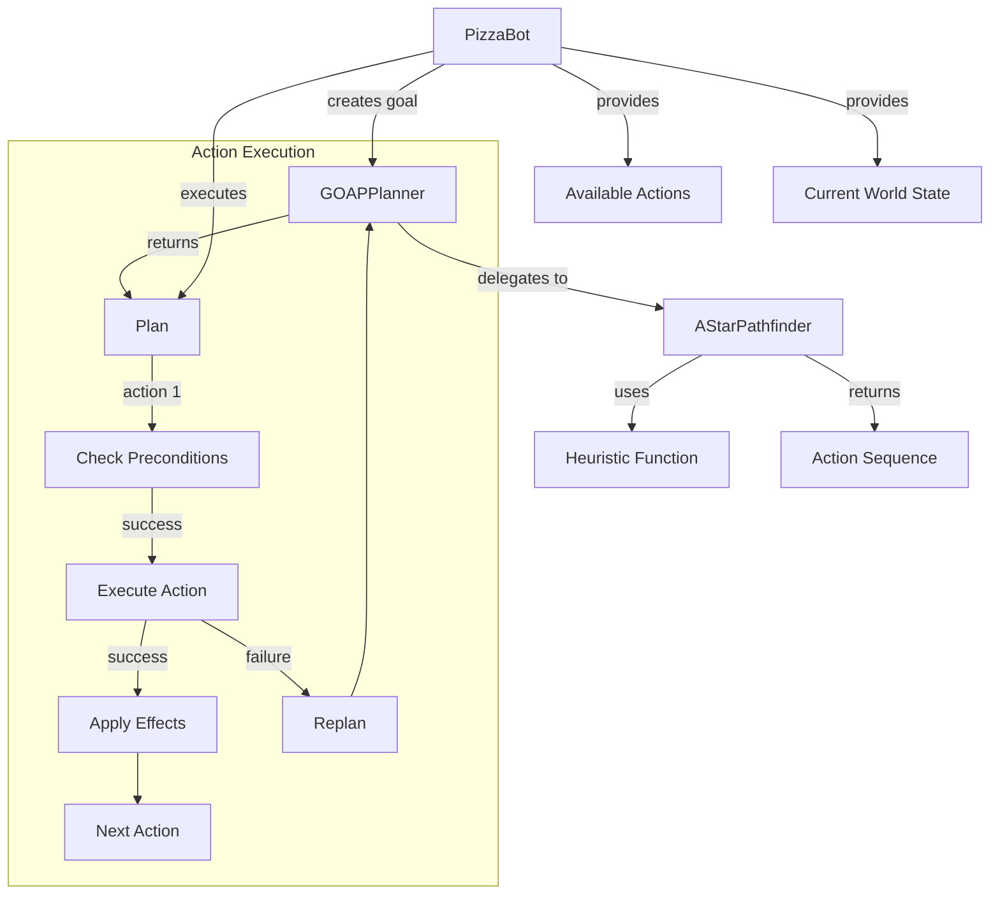
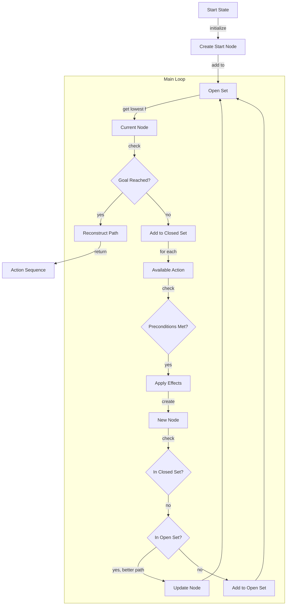
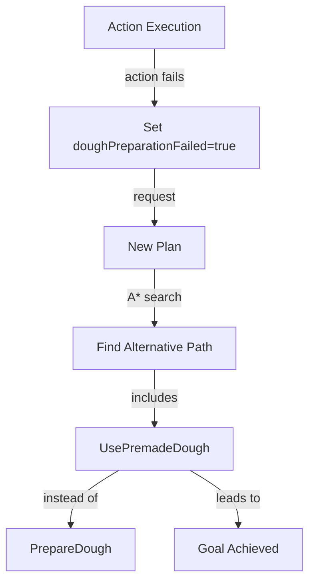
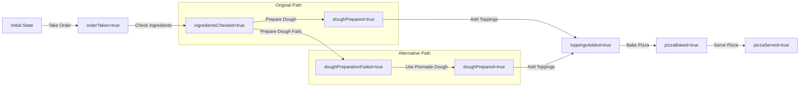

# GOAP System Diagrams

## GOAP System Architecture

## A* Pathfinding Process

## Replanning Process

## State Transitions Example

These diagrams illustrate how the GOAP system works, particularly focusing on the A* pathfinding algorithm and the replanning process when actions fail.
